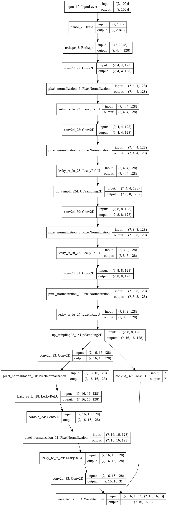

# artiGAN

*by Udi Lumnitz & Ido Levi*

artiGAN is a ProGAN implementation that is trained for generating art. The Progressive Growing GAN is an extension to the GAN that allows the training generator models to be capable of generating large-high-quality images. It was described in the 2017 paper by Tero Karras, et al. from Nvidia titled [“Progressive Growing of GANs for Improved Quality, Stability, and Variation.”](https://arxiv.org/abs/1710.10196).

## Dataset

We chose to use the [Best Artworks of All Time](https://www.kaggle.com/ikarus777/best-artworks-of-all-time) dataset from Kaggle. [Here](https://github.com/lomudi/artigan/blob/main/load_dataset_from_kaggle.ipynb) you can find a short notebook for downloading the dataset to your local machine (you will need to save your Kaggle secret JSON under a `kaggle_env` folder).

## Implementation

**[Full implementation notebook can be found here](https://github.com/lomudi/artigan/blob/main/ArtiGAN.ipynb).**

In our ProGAN implementation we develop each phase of growth as a separate Keras model and each model will share the same layers and weights.

### Custom Layers

We have implemented three custom layers:

* **WeightedSum:** Used to control the weighted sum of the old and new layers during a growth phase.
* **MinibatchStdev:** Used to summarize statistics for a batch of images in the discriminator.
* **PixelNormalization:** Used to normalize activation maps in the generator model.

### Discriminator model

The discriminator model is defined as a deep convolutional neural network that expects a 4×4 color image as input and predicts whether it is real or fake.

It includes the following layers:

* The first hidden layer is a 1×1 convolutional layer.
* The output block involves a MinibatchStdev, 3×3, and 4×4 convolutional layers, and a fully connected layer that outputs a prediction.
* Leaky ReLU activation functions are used after all layers and the output layers use a linear activation function.
* Then, it is trained for normal interval and then the model undergoes a growth phase to 8×8. This involves adding a block of two 3×3 convolutional layers and an average pooling downsample layer.
* The input image passes through the new block with a new 1×1 convolutional hidden layer. 
* The input image is also passed through a downsample layer and through the old 1×1 convolutional hidden layer. 
* The output of the old 1×1 convolution layer and the new block are then combined via a WeightedSum layer.
* After an interval of training transitioning the WeightedSum’s alpha parameter from 0.0 (all old) to 1.0 (all new), another training phase is run to tune the new model with the old layer and pathway removed.

This process repeats until the desired image size is met.

***discriminator model plot***

### Generator model

The generator model takes a random point from the latent space as input and generates a synthetic image and it is defined in the same way as the discriminator models.

It includes a base model for generating 4×4 images and growth versions of the model are created for the large image output size.

The growth phase is the main different between the discriminator and the generator models.

* In the generator model the output of the model is the output of the WeightedSum layer.
* The growth phase version of the model involves first adding a nearest neighbor upsampling layer.
* This is then connected to the new block with the new output layer and to the old old output layer.
* The old and new output layers are then combined via a WeightedSum output layer.

The base model has an input block defined with a fully connected layer with a similar number of activations to create a given number of 4×4 feature maps.

This is followed by 4×4 and 3×3 convolution layers and a 1×1 output layer that generates color images. Then, new blocks are added with an upsample layer and two 3×3 convolutional layers.

The LeakyReLU activation function is used and the PixelNormalization layer is used after each convolutional layer. A linear activation function is used in the output layer.

***generator model plot***

### Composite model

After we have implemented the **discriminator** and the **generator** models. We have implemented a **composite** model for each pair of models that stacks the generator on top of the discriminator so that the synthetic image feeds directly into the discriminator model to be deemed real or fake.

### Training

In order to be able to train our models, we have implemented a few helpers functions, for generating real or fake images, summarize the training performance, and more.

Then, in order to update the alpha value on each instance of WeightedSum, we have implemented the `update_fadein()` function.

The `train_epochs()` function implements the training of the discriminator and generator models for a single training phase. And, the `train()` function pulls all together, taking the lists of defined models as input as well as the list of batch sizes and the number of training epochs for the normal and fade-in phases at each level of growth for the model.

## Results

We have been running 2 training sessions of the model:

* Training by a dataset of 439 images of Pablo Picasso. We have run the training with 3 running blocks and created a model with an image resolution of 16x16. Training time was 0.5 an hour. The full training stages results can found [here](https://github.com/lomudi/artigan/blob/main/Pablo_Picasso_Results).

* Training by a dataset of 8027 images of different artists. We have run it with 3 running blocks and created a model with an image resolution of 16x16. Training time was 9.5 hours. The full training stages results can found [here](https://github.com/lomudi/artigan/blob/main/full-dataset-results).

This ProGAN implementation can be also trained to a higher resolution, we estimate the training time for a resolution of 1024x1024 based on the full dataset in about 20 days (depended on the training computer GPU).

## Conclusions

Unlike other GAN implementations, instead of attempting to train all layers of the generator and discriminator at once, with ProGAN, we are gradually growing our GAN, one layer at a time, to handle progressively higher resolution versions of the images. Such implementations have a price in the need for more compute resources/training time, as we could saw in our training sessions. More than that, when we are getting to a higher resolution block, the training time will have exponential growth.

At first, we have tried to run the model training for higher resolution of 512x512 (8 running blocks) on a server GPU, getting into a server timeouts. Running it locally enables to avoid the server timeouts, but we had to stop the running session at some point.

When we are comparing the results of the two training sessions we have run, we can see the importance of a big and rich dataset. Although we didn't get to high-resolution images in our training sessions, we can see the training results of the "full dataset" include much "richer" images than the "Pablo Picasso dataset" training.

## Run it locally

First clone the project.

**Make sure to install**

* anaconda3 with python 3.7
* jupyter lab / notebook: `conda install -c conda-forge jupyterlab`

**Create ENV for the first time**

* run: `conda install -n artigan`
* run: `source activate artigan`
* run: `pip install -r env.txt`
* open jupyter lab by: `jupyter lab`

**Running after creating ENV for the first time**

* run: `source activate artigan`
* open jupyter lab by: `jupyter lab`
